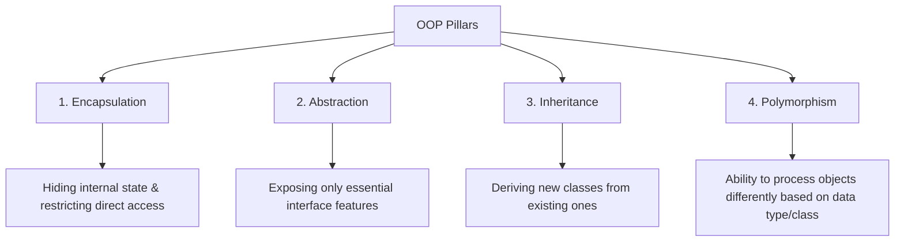

# 🧱 Object-Oriented Programming (OOP) Foundations

Object-Oriented Programming (OOP) is a paradigm based on the concept of "objects", which contain data (attributes) and code (methods).

---

## 🔑 The Four Pillars of OOP

### 1. Encapsulation
- **Definition**: Bundling data and methods that operate on that data within a single unit (class), while restricting access to internal implementation details using access modifiers (`private`, `protected`).
- **Benefit**: Protects object state from invalid mutations and decouples consumers from internal implementation.

### 2. Abstraction
- **Definition**: Hiding background complexity and showing only relevant essential features to the outside world using abstract classes and interfaces.
- **Benefit**: Reduces complexity and allows developers to interact with simplified interfaces.

### 3. Inheritance
- **Definition**: Mechanism where a child class acquires properties and behaviors from a parent class.
- **Caution**: Overuse of deep inheritance trees leads to the **Fragile Base Class** problem. Favor Composition when possible.

### 4. Polymorphism
- **Definition**: "Many forms". Allows treating objects of different classes that implement the same interface or inherit from the same base class interchangeably.
- **Types**:
  - **Compile-time (Static)**: Method Overloading.
  - **Run-time (Dynamic)**: Method Overriding.

---

## 💻 Executable Example & Test Suite
See [`oops-foundations.ts`](./oops-foundations.ts) and [`oops-foundations.test.ts`](./oops-foundations.test.ts).
