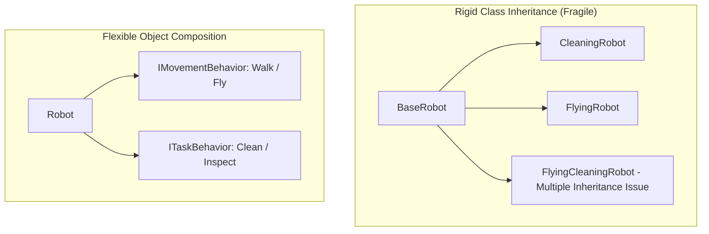

# 🔗 Composition Over Inheritance

> *"Favor object composition over class inheritance."* — Design Patterns: Elements of Reusable Object-Oriented Software (Gang of Four)

---

## 🎯 Why Composition Over Inheritance?

### The Fragile Base Class Problem
Inheritance establishes a tight compile-time **is-a** relationship between parent and child classes. When a parent class implementation changes, child classes can break unexpectedly due to tight coupling to protected internal state.

### Key Differences

| Dimension | Inheritance (**Is-A**) | Composition (**Has-A**) |
| :--- | :--- | :--- |
| **Binding Time** | Static (Compile-time) | Dynamic (Run-time) |
| **Coupling** | High (Exposes parent internals to subclass) | Low (Interacts only via public interfaces) |
| **Flexibility** | Rigid (Cannot switch superclass behavior at runtime) | High (Behaviors can be swapped dynamically) |

---

## 💻 Code & Vitest Suite
See [`composition-vs-inheritance.ts`](./composition-vs-inheritance.ts) and [`composition-vs-inheritance.test.ts`](./composition-vs-inheritance.test.ts).
