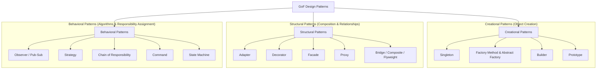

# 🔌 Module 02: Gang of Four (GoF) & Enterprise Design Patterns

Design patterns are refined, standardized solutions to recurring software engineering problems.

---

## 🎯 Master Classification of Design Patterns

---

## 📁 Submodule Navigation

- 🏗️ **[Creational Patterns](./creational)**: Object instantiation mechanisms, decoupling creation from usage.
- 🔌 **[Structural Patterns](./structural)**: Object composition, interface adapting, and subsystem facades.
- 🚦 **[Behavioral Patterns](./behavioral)**: Communication, algorithm encapsulation, and state transition management.
