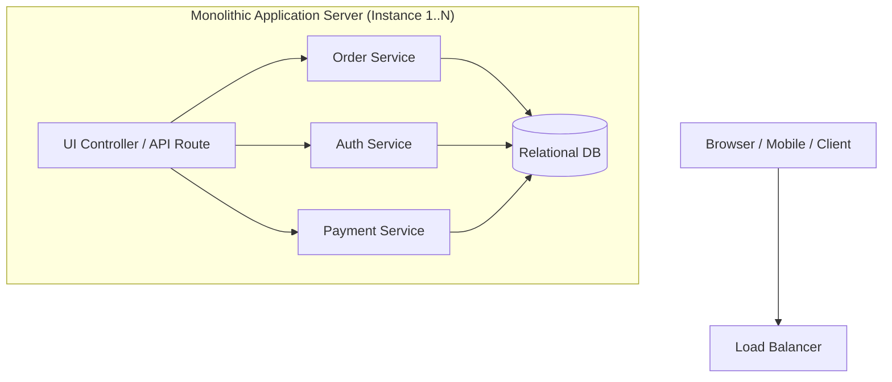

# 🏢 Monolithic Architecture

A monolithic architecture is a unified model for designing a software application where all components, business logic, data access, and UI layers are combined into a single, cohesive deployment unit.

---

## 🏗️ Monolithic Topology

---

## 🎯 When to Use vs. When NOT to Use

### ✅ When to Use
1. **Early-stage startups & MVPs**: Maximizes development velocity; no network/RPC overhead.
2. **Small to Medium Engineering Teams (< 20 engineers)**: Prevents team coordination bottlenecks and complex DevOps overhead.
3. **Low Domain Complexity**: When domain boundaries are fluid and undergoing rapid iteration.

### ❌ When NOT to Use
1. **Multi-team deployment conflicts**: When 100+ engineers are committing to the same codebase causing constant deployment blockages.
2. **Extreme Heterogeneous Scale**: When one subsystem requires massive GPU/RAM scaling while the rest of the application remains idle.
3. **Strict Security / Compliance Boundaries**: When compliance requires isolating payment processing memory from user-generated content.

---

## ⚖️ Tradeoff Matrix

| Metric | Rating | Rationale |
| :--- | :--- | :--- |
| **Development Velocity** | 🟢 Extremely High | Single codebase, in-memory function calls, simple debugging. |
| **Operational Simplicity** | 🟢 High | Single pipeline deployment (`git push` -> build -> deploy artifact). |
| **Performance / Latency** | 🟢 Ultra Low | No cross-network gRPC/HTTP serialization latency between modules. |
| **Scalability** | 🟡 Medium | Scaled horizontally by duplicating entire app instance behind load balancer. |
| **Code Coupling Risk** | 🔴 High | Without strict boundaries, easily devolves into a "Big Ball of Mud". |
