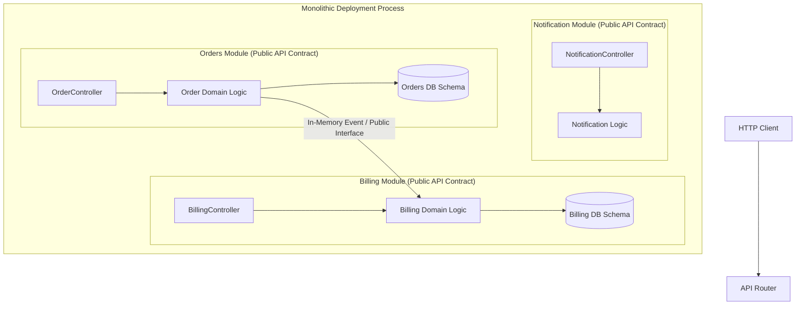

# 📦 Modular Monolith Architecture

A **Modular Monolith** is an architectural pattern where the application is structured as a single deployment artifact, but internally enforced with strict, independent domain module boundaries and private schemas.

---

## 🏗️ Modular Monolith Topology

---

## 🎯 Key Architectural Rules

1. **Strict Package Visibility**: Internal classes are package-private (`internal` / hidden exports). Modules interact ONLY via explicit Public Interfaces or In-Memory Domain Events.
2. **No Direct Cross-Module Database Joins**: The `Orders` module cannot perform SQL `JOIN`s against `Billing` tables. Inter-module queries happen strictly through interface calls.
3. **Module Independence**: Every module could theoretically be extracted into a standalone Microservice with zero rewrite of domain logic.

---

## 🏢 Real-World Case Study: Shopify
Shopify manages over **3,000,000 lines of Ruby on Rails code** in a single Modular Monolith. They built **Packwerk**, a static analysis tool that enforces module boundary violations during CI.
