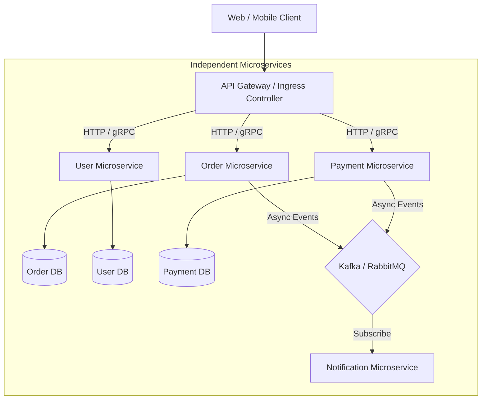

# ⚙️ Microservices Architecture

Microservices architecture structures an application as a collection of small, autonomous services modeled around business domains, independently deployable and communicating via lightweight protocols (gRPC, REST, Kafka).

---

## 🏗️ Microservices Architecture Topology

---

## 🎯 Core Principles

1. **Database-per-Service**: Services MUST NOT share a single database. Shared databases destroy independent deployability and cause schema coupling.
2. **Domain-Driven Boundaries (Bounded Contexts)**: Services are bounded by domain responsibilities (e.g. Fulfillment vs Billing).
3. **Resilience & Fault Isolation**: Failures in one service must not cascade to down-stream services (protected via Circuit Breakers, Retries, and Bulkheads).

---

## 🎯 When to Use vs. When NOT to Use

### ✅ When to Use
- Large engineering organizations (50+ engineers across multiple autonomous teams).
- Subsystems with radically different scale profiles (e.g. high-throughput streaming video vs low-frequency user profile updates).
- Clear domain boundaries established through years of domain experience.

### ❌ When NOT to Use
- New products/startups with unproven product-market fit.
- Small engineering teams (< 15 developers) without dedicated platform/SRE engineering support.
- Low latency requirements sensitive to inter-service network hops.
