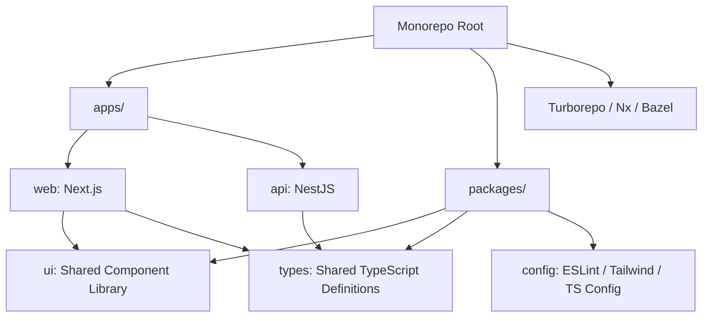

# 🗂️ Monorepo Architecture

A **Monorepo** (Monolithic Repository) is an architectural strategy where multiple distinct projects and shared packages are co-located within a single source control repository.

---

## 🏗️ Monorepo Structure & Tooling

---

## 🎯 Monorepo vs Polyrepo Comparison

| Feature | Monorepo | Polyrepo (Multi-Repo) |
| :--- | :--- | :--- |
| **Code Sharing** | 🟢 Effortless via local workspace symlinks | 🔴 High friction (Requires publishing to NPM registry) |
| **Atomic Refactoring** | 🟢 Refactor breaking API across client & server in 1 PR | 🔴 Requires multi-repo PR orchestration across teams |
| **Tooling & CI** | 🟡 Requires smart build caching (Turborepo/Nx) | 🟢 Simple isolated CI files per repo |
| **Access Control** | 🔴 Single repo access control | 🟢 Granular repository permissions |

---

## ⚡ Build Optimization & Remote Caching
Modern monorepos utilize **Task Graph Dependency Hashing** and **Remote Caching**:
- If `packages/ui` has not changed, Turborepo reuses the cached build artifact across local developer machines and CI build runners, reducing build times from minutes to seconds.
