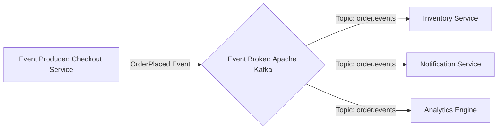

# 📡 Event-Driven Architecture (EDA)

Event-Driven Architecture (EDA) is a software architecture pattern where decoupled components communicate asynchronously by emitting, detecting, and consuming **events**.

---

## 🏗️ Event-Driven Communication Model

---

## 🎯 Core Patterns in Event-Driven Systems

1. **Publish-Subscribe (Pub/Sub)**: Producers emit events without knowing who consumes them. Multiple subscribers consume the message independently.
2. **Event Sourcing**: Storing all changes to application state as a sequence of immutable events rather than mutating current entity state in a database.
3. **Change Data Capture (CDC)**: Streaming database write logs (Postgres WAL, MySQL Binlog) via Debezium directly into Kafka topics.

---

## ⚖️ Tradeoff Analysis
- **Pros**: Extreme decoupling, horizontal throughput, failure tolerance (consumers catch up when recovered).
- **Cons**: Eventual consistency complexity, out-of-order event handling, difficult distributed debugging.
