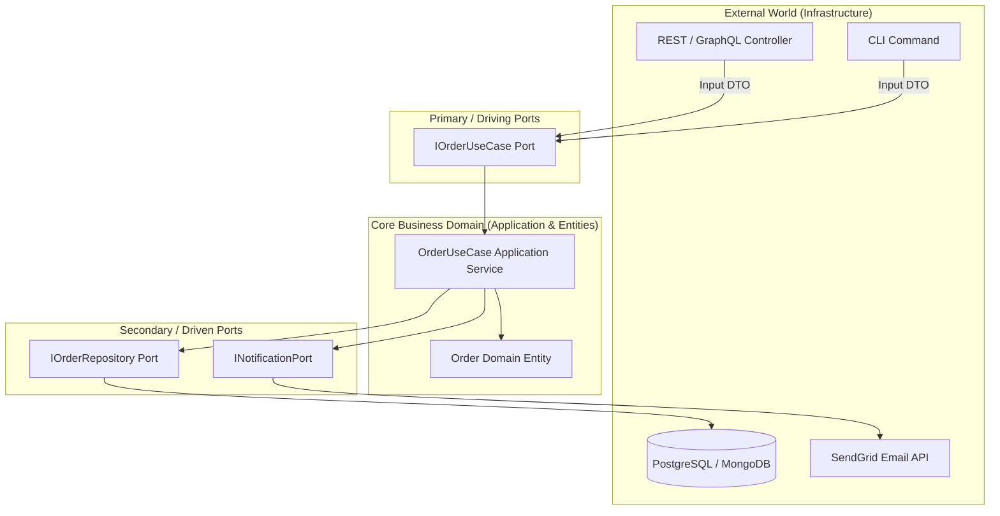

# 🏛️ Clean & Hexagonal Architecture (Ports & Adapters)

Hexagonal Architecture (coined by Alistair Cockburn) and Clean Architecture (Robert C. Martin) isolate core business domain logic from external frameworks, databases, and UI representations.

---

## 🏗️ The Hexagonal Architecture Topology

---

## 🔑 Dependency Rule
**Dependencies point INWARD towards the Core Domain**. The Core Domain knows NOTHING about HTTP, NestJS, Prisma, TypeORM, SQL, or SendGrid.

---

## 💻 Code & Vitest Suite
See [`clean-architecture.ts`](./clean-architecture.ts) and [`clean-architecture.test.ts`](./clean-architecture.test.ts).
