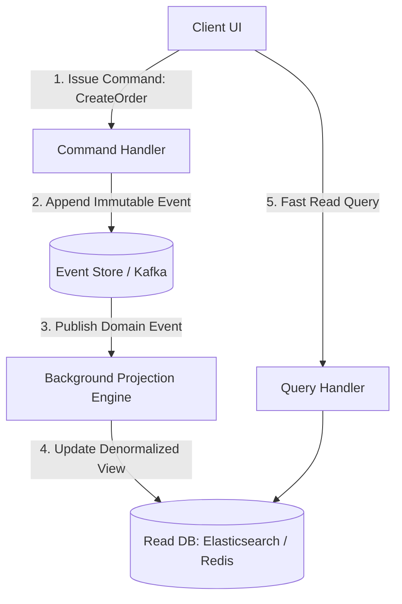

# 🔄 CQRS & Event Sourcing

**CQRS** (Command Query Responsibility Segregation) and **Event Sourcing** are complementary patterns that separate read models from write models and model state as an immutable append-only event stream.

---

## 🏗️ CQRS & Event Sourcing Flow

---

## 🔑 Key Concepts

1. **CQRS**: Split Command operations (state mutations returning no data) from Query operations (read views returning data with zero side effects).
2. **Event Sourcing**: Instead of storing the current state (`users.balance = 500`), store the full immutable ledger of events (`[Deposited 200, Withdrew 50, Deposited 350]`).
3. **Projections**: Asynchronous processors that consume events to build specialized, highly optimized read views (e.g., Elasticsearch search indices, Redis Leaderboards).
