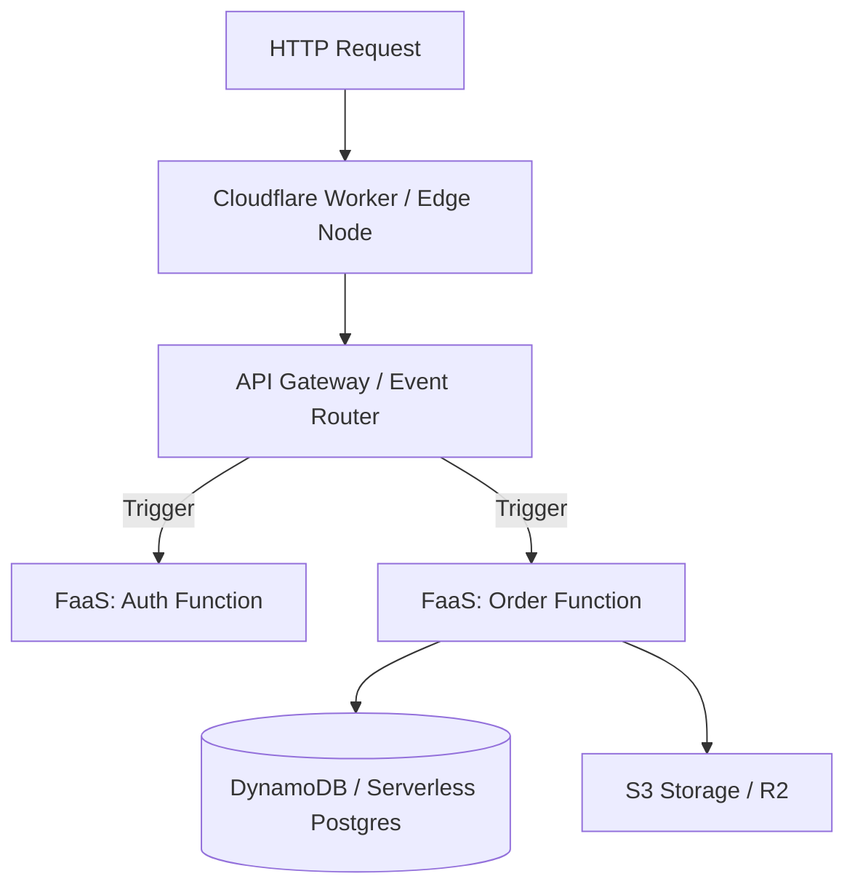

# ☁️ Serverless & Edge Architecture

Serverless computing allows developers to build applications without managing infrastructure (servers, clusters, OS patching).

---

## 🏗️ Serverless Event-Driven Topology

---

## ⚖️ Tradeoff Matrix

| Aspect | Benefit / Tradeoff |
| :--- | :--- |
| **Cost Profile** | Pay-per-invocation ($0 when idle) |
| **Scalability** | Instant horizontal scaling to thousands of concurrent executions |
| **Cold Starts** | Initial execution latency when function scales from 0 instances |
| **Vendor Lock-in** | High dependency on cloud provider SDKs (AWS Lambda vs Cloudflare Workers) |
