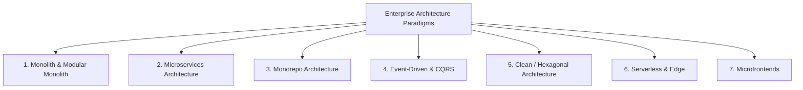

# 🏢 Module 03: Enterprise Architecture Paradigms

This module contains deep-dive documentation, trade-off matrices, decision criteria, and real-world architectural diagrams across major enterprise software topologies.

---

## 🗺️ Architectural Styles Comparison

---

## 📊 Paradigm Comparison Matrix

| Architectural Style | Operational Overhead | Deployment Autonomy | Latency / Perf | Scalability Boundary | Primary Risk / Anti-Pattern |
| :--- | :--- | :--- | :--- | :--- | :--- |
| **Traditional Monolith** | Low | Low (Single Release) | Ultra-Low (In-Memory) | Vertical / Instance Clones | Distributed Monolith, Big Ball of Mud |
| **Modular Monolith** | Medium-Low | Low-Medium | Ultra-Low (In-Memory) | Vertical / Module Splits | Leaky Module Encapsulation |
| **Microservices** | High (K8s, Mesh, Tracing)| High (Independent) | Network Overhead | Horizontal per Domain | Microservice Sprawl, Distributed Latency |
| **Monorepo** | Medium (Tooling setup) | Medium | High (Shared Code) | Codebase Scale | Slow CI Pipelines without Remote Caching |
| **Event-Driven (EDA)** | High | High | Asynchronous | High (Event Streams) | Eventual Consistency Incoherence |
| **Clean/Hexagonal** | Low | Low | Negligible | Code Maintainability | Over-abstraction & Boilerplate |
| **Serverless** | Very Low (Managed) | High | Cold Start Latency | Automatic Horizontal | Vendor Lock-in, Runaway Costs |

---

## 📁 Submodule Directory

1. 🏢 **[Monolithic Architecture](./01-monolithic-architecture)**
2. 📦 **[Modular Monolith](./02-modular-monolith)**
3. ⚙️ **[Microservices Architecture](./03-microservices-architecture)**
4. 🗂️ **[Monorepo Architecture](./04-monorepo-architecture)**
5. 📡 **[Event-Driven Architecture](./05-event-driven-architecture)**
6. 🏛️ **[Clean & Hexagonal Architecture](./06-clean-hexagonal-architecture)**
7. 🔄 **[CQRS & Event Sourcing](./07-cqrs-and-event-sourcing)**
8. ☁️ **[Serverless & Edge Architecture](./08-serverless-and-edge)**
9. 🧩 **[Microfrontends Architecture](./09-microfrontends)**
