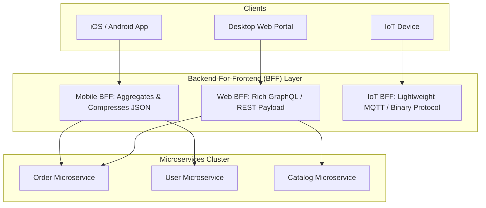

# 🌐 API Gateway & Backend-For-Frontend (BFF)

The **API Gateway** acts as the single entry point for all client requests into an enterprise microservice architecture. The **Backend-For-Frontend (BFF)** variation creates tailored gateway layer adapters per client type (Mobile iOS vs Web Desktop vs IoT).

---

## 🏗️ API Gateway vs. BFF Architecture

---

## 🔑 Key API Gateway Responsibilities

1. **Request Routing**: Proxies external URIs to internal microservice IP addresses.
2. **Authentication & Token Validation**: Offloads JWT verification so downstream microservices receive pre-authenticated headers.
3. **Protocol Translation**: Converts external REST/GraphQL into high-speed internal gRPC.
4. **Rate Limiting & Threat Protection**: Shields internal services from DDoS, brute-force, and parameter pollution.
