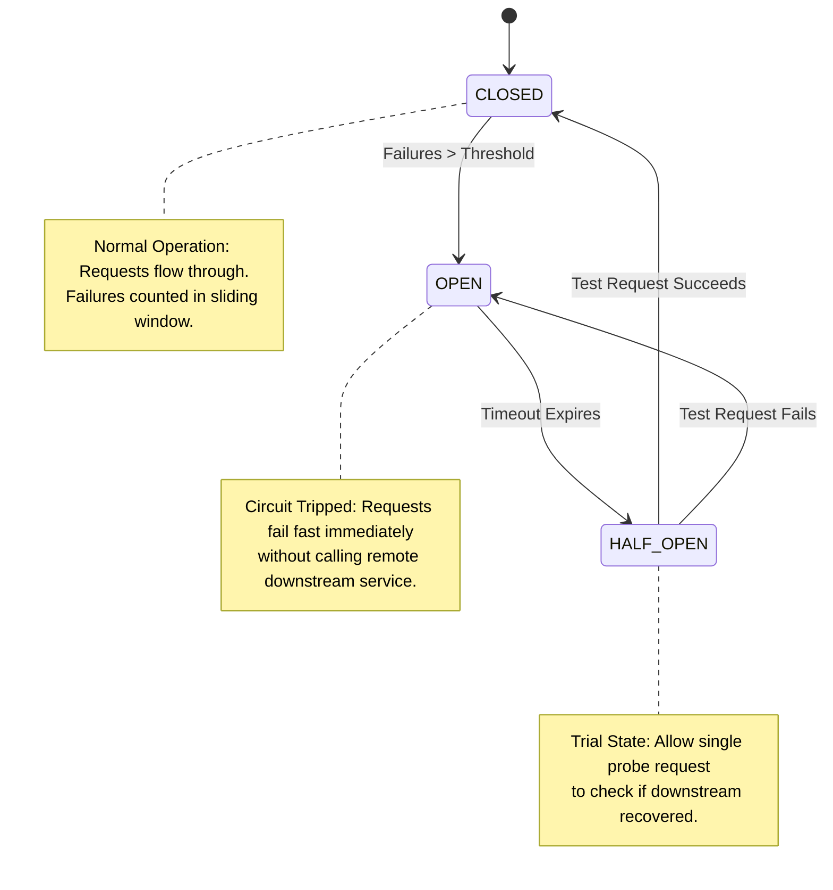

# ⚡ Circuit Breaker Pattern

The Circuit Breaker pattern prevents an application from repeatedly trying to execute an operation that's likely to fail, allowing services to recover without overwhelming downstream resources.

---

## 🏗️ State Machine Diagram

---

## 💻 Code & Vitest Suite
See [`circuit-breaker.ts`](./circuit-breaker.ts) and [`circuit-breaker.test.ts`](./circuit-breaker.test.ts).
