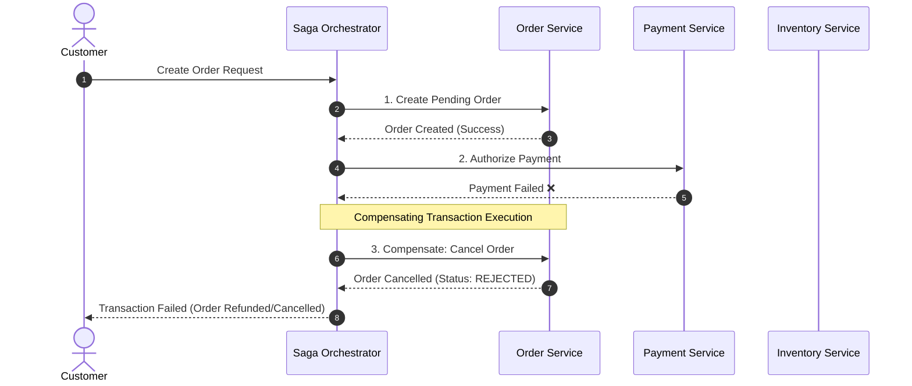

# 🔄 Saga Pattern (Distributed Transactions)

The **Saga Pattern** manages distributed transactions across multiple microservices by decomposing a multi-step business transaction into a series of local transactions. Each local transaction updates the service's database and emits an event to trigger the next step. If a step fails, the saga executes **compensating transactions** in reverse order to undo changes.

---

## 🏗️ Orchestration vs. Choreography

---

## ⚖️ Orchestration vs Choreography Comparison

| Dimension | Saga Orchestration | Saga Choreography |
| :--- | :--- | :--- |
| **Control Logic** | Centralized Saga Orchestrator coordinates steps | Decentralized; services react to pub-sub events |
| **Coupling** | Orchestrator knows all participating services | Low coupling; services listen to domain topics |
| **Complexity** | Easy to reason about flow state | Difficult to trace complete workflow with many steps |
| **Best For** | Complex workflows with 4+ steps & error branches | Simple 2-3 step linear flows |
