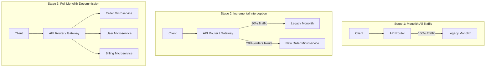

# 🌳 Strangler Fig Migration Pattern

The **Strangler Fig Pattern** (coined by Martin Fowler) describes a strategy for incrementally replacing a legacy monolithic system by creating new microservices around the edges of the legacy app, until the legacy system is eventually "strangled" and decommissioned.

---

## 🏗️ Migration Stages

---

## 🔑 Key Rules for Successful Migration
1. **Never attempt a Big Bang Rewrite**: Big Bang rewrites of mature enterprise monoliths fail at an alarmingly high rate due to undocumented edge case business logic.
2. **Intercept at the Gateway Layer**: Use URL routing rules to switch traffic per endpoint path.
3. **Use Data Synchronization**: Mirror database updates during transition phases using Change Data Capture (CDC).
