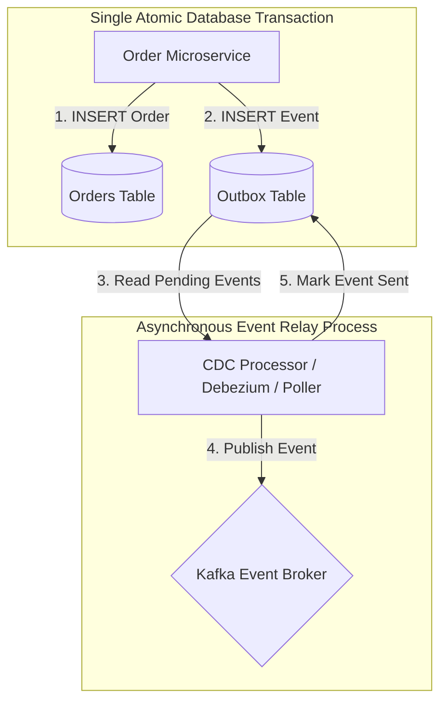

# 📬 Transactional Outbox Pattern

The **Transactional Outbox Pattern** guarantees reliable messaging in microservices by solving the **dual-write problem** (updating a database and publishing a message to Kafka/RabbitMQ in two un-atomic network operations).

---

## 🏗️ Outbox Pattern Topology

---

## 🔑 Why is this mandatory in Distributed Systems?
If a service updates the database first and then attempts to publish a message to Kafka:
- If Kafka is down or network blips occur, the database commit succeeds, but consumers **never** receive the event (inconsistent state).
- If you publish to Kafka first, and the DB transaction rolls back, consumers act on **phantom data**.
- The Outbox pattern writes both records into the same ACID database transaction, guaranteeing **At-Least-Once Delivery**.
