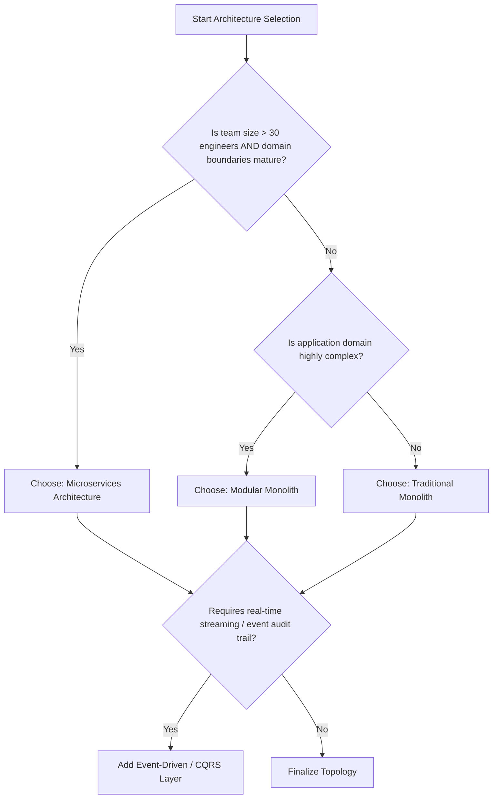

# 🌳 Interactive Architectural Decision Trees

Use these decision flowcharts to choose the optimal architectural topology for your project.

---

## 🎯 Primary Architectural Style Selector

```mermaid
graph TD
    Start[Start Architecture Selection] --> Q1{Is team size > 30 engineers AND domain boundaries mature?}
    
    Q1 -- No --> Q2{Is application domain highly complex?}
    Q1 -- Yes --> Microservices[Choose: Microservices Architecture]

    Q2 -- Yes --> ModMono[Choose: Modular Monolith]
    Q2 -- No --> Mono[Choose: Traditional Monolith]

    Microservices --> Q3{Requires real-time streaming / event audit trail?}
    ModMono --> Q3
    Mono --> Q3

    Q3 -- Yes --> EDA[Add Event-Driven / CQRS Layer]
    Q3 -- No --> Done[Finalize Topology]
```
